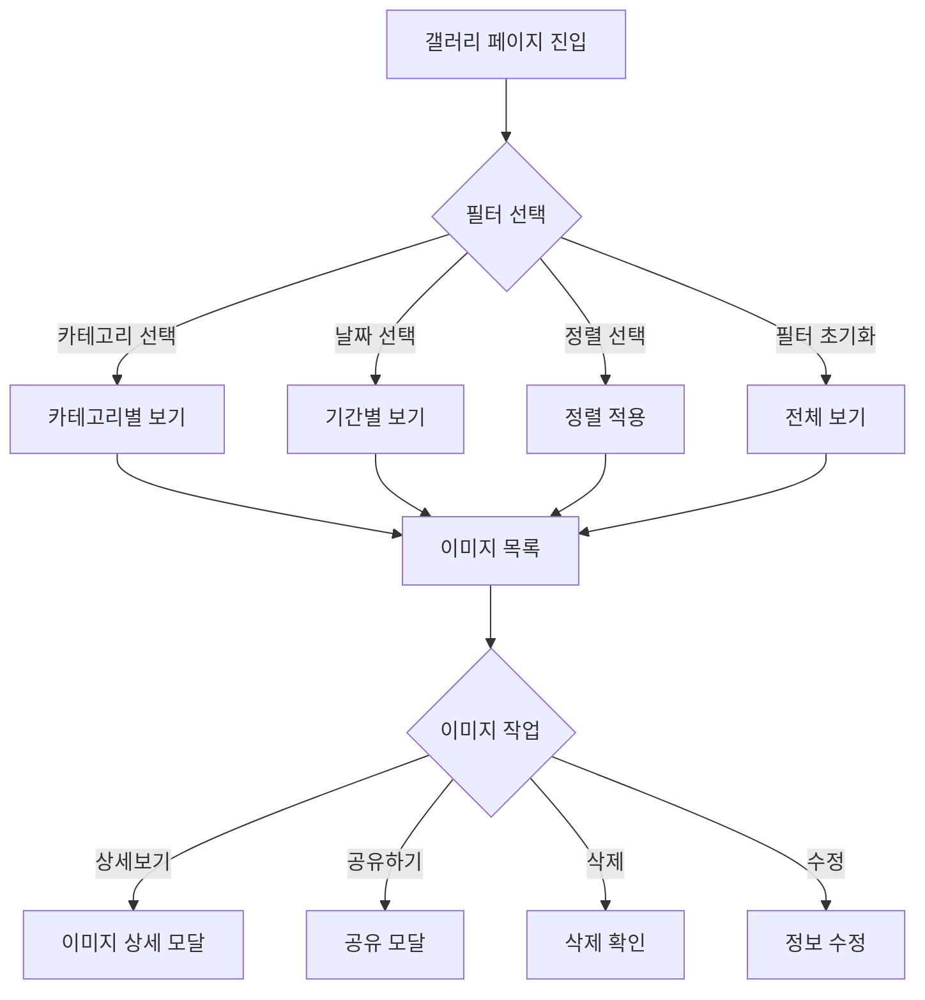
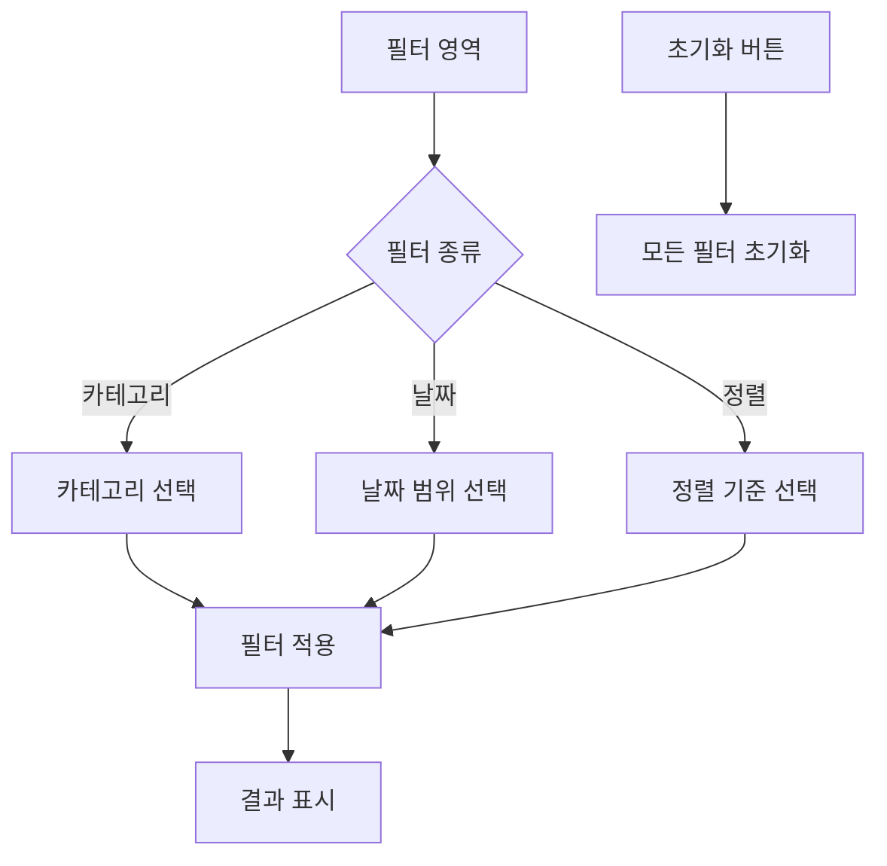
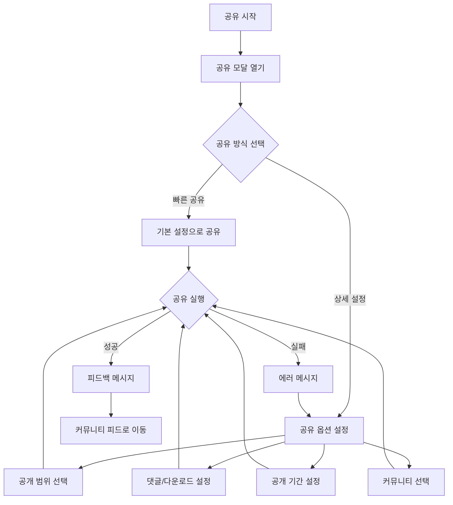

# 갤러리 관리 및 커뮤니티 공유 화면 기능명세서

## 사용자 흐름도

### 1. 갤러리 관리 흐름


### 2. 필터링 및 정렬 흐름


### 3. 커뮤니티 공유 흐름


### 3. 주요 사용자 시나리오

1. **기본 갤러리 관리**
   ```
   갤러리 진입 → 카테고리 선택 → 이미지 보기 → 정보 수정/삭제
   ```

2. **새 카테고리 생성**
   ```
   갤러리 진입 → '새 카테고리' 클릭 → 이름 입력 → 생성 → 이미지 이동/추가
   ```

3. **이미지 공유하기**
   ```
   이미지 선택 → 공유 버튼 → 공유 설정 → 공유 실행 → 커뮤니티 확인
   ```

4. **일괄 작업**
   ```
   갤러리 진입 → 다중 선택 모드 → 이미지 선택 → 일괄 작업(이동/삭제/공유)
   ```

### 4. 예외 처리 흐름

1. **네트워크 오류**
   ```
   작업 시도 → 네트워크 오류 발생 → 오류 메시지 표시 → 재시도 옵션 제공
   ```

2. **권한 부족**
   ```
   작업 시도 → 권한 확인 실패 → 안내 메시지 → 권한 획득 방법 안내
   ```

3. **저장 공간 부족**
   ```
   업로드 시도 → 용량 확인 → 부족 시 알림 → 정리 가이드 제공
   ```

## 프론트엔드 기능명세서

### 1. 화면 레이아웃 및 디자인 명세

#### 필터 섹션
- **파일 위치**: `components/gallery/GalleryFilter.tsx`

1. **필터 컴포넌트**
   - **UI 구성**:
     - 카테고리 필터 (Tabs)
     - 날짜 범위 선택 (DateRangePicker)
     - 정렬 기준 선택 (Select)
     - 필터 초기화 버튼
   - **Props 인터페이스**:
     ```typescript
     interface IGalleryFilter {
       selectedCategory: string;
       dateRange: DateRange;
       sortBy: 'latest' | 'oldest' | 'name';
       onCategoryChange: (category: string) => void;
       onDateRangeChange: (range: DateRange) => void;
       onSortChange: (sort: string) => void;
       onReset: () => void;
     }

     interface DateRange {
       from: Date | null;
       to: Date | null;
     }
     ```

2. **날짜 선택 컴포넌트**
   - **UI 구성**:
     - 시작일/종료일 선택
     - 달력 팝업
     - 빠른 선택 (오늘, 이번 주, 이번 달)
   - **상호작용**:
     - 날짜 범위 직접 선택
     - 프리셋 기간 선택
     - 선택 초기화

3. **정렬 옵션 컴포넌트**
   - **UI 구성**:
     - 최신순/과거순/이름순 선택
     - 현재 정렬 상태 표시
   - **상호작용**:
     - 정렬 기준 변경 시 즉시 적용
     - 정렬 상태 유지

4. **필터 초기화 버튼**
   - **UI 구성**:
     - 모든 필터 초기화 버튼
     - 활성 필터 개수 표시
   - **상호작용**:
     - 클릭 시 모든 필터 기본값으로 복원
     - 필터 적용 중일 때만 활성화

#### 갤러리 관리 섹션
- **파일 위치**: `app/gallery/page.tsx`

1. **카테고리 관리 컴포넌트** (`components/gallery/CategoryManager.tsx`)
   - **UI 구성**: 
     - ShadcN의 `Tabs` 컴포넌트를 활용한 카테고리 탭 
     - 카테고리 추가/수정/삭제 기능
   - **Props 인터페이스**:
     ```typescript
     interface ICategoryManager {
       categories: ICategory[];
       selectedCategory: string;
       onCategoryChange: (category: string) => void;
       onCategoryAdd: (newCategory: ICategory) => void;
       onCategoryEdit: (categoryId: string, newName: string) => void;
       onCategoryDelete: (categoryId: string) => void;
     }
     ```
   - **상호작용**:
     - 카테고리 선택 시 해당 카테고리의 이미지만 필터링하여 표시
     - 카테고리 추가/수정/삭제 시 즉시 UI 반영

2. **갤러리 그리드 컴포넌트** (`components/gallery/GalleryGrid.tsx`)
   - **UI 구성**:
     - Masonry 레이아웃의 반응형 그리드
     - 이미지 카드 컴포넌트
     - 무한 스크롤 구현
   - **Props 인터페이스**:
     ```typescript
     interface IGalleryGrid {
       images: IGalleryImage[];
       onImageSelect: (image: IGalleryImage) => void;
       onLoadMore: () => void;
       hasMore: boolean;
       isLoading: boolean;
     }
     ```
   - **이미지 카드 기능**:
     - 이미지 미리보기
     - 생성 날짜 표시
     - 카테고리 태그
     - 공유 상태 표시
     - 컨텍스트 메뉴 (수정/삭제/공유)

3. **이미지 상세 모달** (`components/gallery/ImageDetailModal.tsx`)
   - **UI 구성**:
     - ShadcN의 `Dialog` 컴포넌트 활용
     - 이미지 상세 정보 표시
     - 편집 기능
   - **Props 인터페이스**:
     ```typescript
     interface IImageDetailModal {
       image: IGalleryImage;
       isOpen: boolean;
       onClose: () => void;
       onEdit: (updates: Partial<IGalleryImage>) => void;
       onShare: (image: IGalleryImage) => void;
       onDelete: (imageId: string) => void;
     }
     ```

#### 커뮤니티 공유 섹션
- **파일 위치**: `app/gallery/share/page.tsx`

1. **공유 게시물 작성 폼** (`components/gallery/SharePostForm.tsx`)
   - **UI 구성**:
     - 선택된 이미지 미리보기
     - 제목 입력 필드
     - 설명 입력 필드 (마크다운 지원)
     - 태그 입력 컴포넌트
   - **Props 인터페이스**:
     ```typescript
     interface ISharePostForm {
       image: IGalleryImage;
       onSubmit: (postData: IPostData) => void;
       isSubmitting: boolean;
     }
     ```
   - **상호작용**:
     - **이미지 미리보기**:
       - 이미지 클릭 시 전체화면 모달로 확대
       - 드래그로 이미지 위치 조정 가능
     - **제목 입력**:
       - 최소 5자, 최대 100자 제한
       - 실시간 글자 수 표시
       - 중복 제목 실시간 체크
     - **설명 입력**:
       - 마크다운 실시간 미리보기
       - 이미지 드래그 앤 드롭 업로드
       - 최대 2000자 제한
     - **태그 입력**:
       - 엔터 키로 태그 추가
       - 자동 완성 추천 (기존 인기 태그)
       - 최대 10개 태그 제한
       - 중복 태그 자동 필터링
     - **공개 설정**:
       - 공개/비공개 토글 스위치
       - 공개 시 커뮤니티 피드에 즉시 표시
     - **제출 처리**:
       - 모든 필수 필드 입력 시 제출 버튼 활성화
       - 제출 중 로딩 상태 표시
       - 성공/실패 시 토스트 메시지로 피드백
       - 성공 시 커뮤니티 피드로 자동 이동

2. **커뮤니티 공유 모달** (`components/gallery/ShareModal.tsx`)
   - **UI 구성**:
     - ShadcN의 `Dialog` 컴포넌트 활용
     - 이미지 미리보기 섹션
     - 공유 옵션 설정 섹션
     - 작업 버튼 그룹
   - **Props 인터페이스**:
     ```typescript
     interface IShareModal {
       image: IGalleryImage;
       isOpen: boolean;
       onClose: () => void;
       onShare: (shareOptions: IShareOptions) => void;
       isSharing: boolean;
     }

     interface IShareOptions {
       visibility: 'public' | 'private' | 'followers';
       allowComments: boolean;
       allowDownload: boolean;
       expiryDate?: Date;
       selectedCommunities?: string[];
     }
     ```
   - **상호작용**:
     - **공유 옵션 설정**:
       - 공개 범위 선택 (전체 공개/팔로워만/비공개)
       - 댓글 허용 여부 토글
       - 다운로드 허용 여부 토글
       - 공개 기간 설정 (선택사항)
       - 공유할 커뮤니티 선택 (다중 선택 가능)
     - **작업 버튼**:
       - '공유하기' 버튼:
         - 클릭 시 선택된 옵션으로 공유 실행
         - 공유 중 로딩 상태 표시
         - 성공/실패 시 토스트 메시지
       - '취소' 버튼:
         - 모달 닫기
         - 입력된 옵션 초기화
       - '임시저장' 버튼:
         - 현재 설정을 드래프트로 저장
         - 다음 공유 시 저장된 설정 자동 적용
     - **단축키**:
       - Enter: 공유하기
       - Esc: 모달 닫기
       - Ctrl/Cmd + S: 임시저장
     - **드래그 앤 드롭**:
       - 이미지 영역에 새 이미지 드롭으로 교체 가능
     - **미리보기**:
       - 선택된 옵션에 따른 공유 결과 실시간 미리보기
     - **유효성 검사**:
       - 필수 옵션 선택 확인
       - 공개 기간 유효성 검사
       - 선택된 커뮤니티 존재 여부 확인

### 2. 데이터 구조

1. **갤러리 이미지 데이터**
   ```typescript
   interface IGalleryImage {
     id: string;
     imageUrl: string;
     prompt: string;
     styleOptions: IStyleOption[];
     categoryId: string;
     createdAt: string;
     isPublic: boolean;
     tags?: string[];
   }

   interface ICategory {
     id: string;
     name: string;
     imageCount: number;
   }
   ```

2. **공유 게시물 데이터**
   ```typescript
   interface IPostData {
     imageId: string;
     title: string;
     description: string;
     tags: string[];
     visibility: 'public' | 'private';
   }
   ```

3. **필터 상태**
   ```typescript
   interface IFilterState {
     category: string;
     dateRange: {
       from: Date | null;
       to: Date | null;
     };
     sortBy: 'latest' | 'oldest' | 'name';
   }
   ```

4. **정렬 옵션**
   ```typescript
   interface ISortOption {
     value: 'latest' | 'oldest' | 'name';
     label: string;
   }
   ```

### 3. 상태 관리

1. **필터 상태**
   - 선택된 카테고리 상태
   - 날짜 범위 상태
   - 정렬 기준 상태
   - 필터 활성화 상태

2. **갤러리 상태**
   - 필터링된 이미지 목록
   - 정렬된 이미지 목록
   - 페이지네이션 상태

## 백엔드 기능명세서

### 1. API 엔드포인트

1. **갤러리 API**
   - **경로**: `app/api/gallery/route.ts`
   - **메서드**: 
     - `GET`: 이미지 목록 조회
     - `POST`: 새 이미지 추가
     - `PUT`: 이미지 정보 수정
     - `DELETE`: 이미지 삭제

2. **카테고리 API**
   - **경로**: `app/api/gallery/categories/route.ts`
   - **메서드**:
     - `GET`: 카테고리 목록 조회
     - `POST`: 새 카테고리 추가
     - `PUT`: 카테고리 수정
     - `DELETE`: 카테고리 삭제

3. **공유 API**
   - **경로**: `app/api/gallery/share/route.ts`
   - **메서드**: `POST`
   - **응답**: `{ success: boolean, postId: string }`

### 2. 데이터베이스 스키마

1. **GalleryImages 테이블**
   ```sql
   CREATE TABLE gallery_images (
     id TEXT PRIMARY KEY,
     userId TEXT NOT NULL,
     imageUrl TEXT NOT NULL,
     prompt TEXT NOT NULL,
     styleOptions JSON NOT NULL,
     categoryId TEXT,
     createdAt TIMESTAMP DEFAULT CURRENT_TIMESTAMP,
     isPublic BOOLEAN DEFAULT false,
     tags TEXT[],
     FOREIGN KEY (userId) REFERENCES users(id),
     FOREIGN KEY (categoryId) REFERENCES categories(id)
   );
   ```

2. **Categories 테이블**
   ```sql
   CREATE TABLE categories (
     id TEXT PRIMARY KEY,
     userId TEXT NOT NULL,
     name TEXT NOT NULL,
     createdAt TIMESTAMP DEFAULT CURRENT_TIMESTAMP,
     FOREIGN KEY (userId) REFERENCES users(id)
   );
   ```

### 3. 테스트 항목

1. **갤러리 기능 테스트**
   - 이미지 목록 로딩 및 필터링
   - 카테고리 CRUD 작업
   - 이미지 정보 수정
   - 무한 스크롤 동작

2. **공유 기능 테스트**
   - 게시물 작성 폼 유효성 검사
   - 이미지 공유 권한 검증
   - 태그 입력 및 처리

3. **성능 테스트**
   - 이미지 로딩 속도
   - 페이지네이션 처리
   - 데이터베이스 쿼리 최적화 

# 갤러리 이미지 수정 기능

## 1. 수정 버튼 작동 방식
- 갤러리 이미지 카드에 마우스를 올리면 수정(연필) 아이콘이 표시됨
- 수정 아이콘 클릭 시 수정 모달창이 열림
- 수정은 기존 이미지의 프롬프트를 기반으로 새로운 이미지를 생성하는 방식

## 2. 수정 모달창 (EditImageModal)
### 2.1 모달창 구성요소
- 기존 이미지 미리보기 (aspect-square)
- 기존 프롬프트 수정 영역
- 추가 프롬프트 입력 영역
- 최종 프롬프트 미리보기
- 스타일 옵션 선택 (Generate 페이지와 동일한 옵션)
- 작업 버튼 (취소, 새 버전 생성)

### 2.2 프롬프트 수정 영역
- **기존 프롬프트 수정**
  - 기존 프롬프트 직접 수정 가능
  - 원래 프롬프트로 되돌리기 버튼 제공
  - 글자 수 제한 표시 (500자)
- **추가 프롬프트 입력**
  - 새로운 프롬프트 추가 입력
  - 글자 수 제한 표시 (500자)
- **최종 프롬프트 미리보기**
  - 기존 프롬프트와 추가 프롬프트가 결합된 형태 표시
  - 복사 버튼 제공

### 2.3 프롬프트 결합 로직
- 기존 프롬프트만 있는 경우: 기존 프롬프트만 사용
- 추가 프롬프트만 있는 경우: 추가 프롬프트만 사용
- 둘 다 있는 경우: "기존 프롬프트, 추가 프롬프트" 형태로 결합
- 자동 공백 제거 (trim)

## 3. 이미지 생성 및 저장
### 3.1 새 버전 생성
- 결합된 프롬프트로 새 이미지 생성
- 원본 이미지는 유지
- 새 버전은 자동으로 버전 넘버링
  - 예: "image_1_v2", "image_1_v3"

### 3.2 버전 관리
- 모든 버전은 갤러리에서 개별 이미지로 관리
- 버전 간 연결 정보 유지 (ID 기반)
- 원본과 파생 버전 간의 관계 표시

### 3.3 저장 프로세스
1. 입력 유효성 검사 (빈 프롬프트 체크)
2. 이미지 생성 진행률 표시 (로딩 스피너)
3. 생성 완료 후 자동 저장
4. 성공/실패 토스트 메시지 표시

## 4. UI/UX 고려사항
- 모달 열릴 때 초기값 자동 설정
- 실시간 프롬프트 결합 미리보기
- 로딩 중 상태 표시 (버튼 비활성화 + 스피너)
- 에러 발생 시 적절한 피드백
- 복사 기능 제공 (클립보드)
- 원래 값으로 되돌리기 기능

## 5. 제한사항
- 한 번에 하나의 이미지만 수정 가능
- 생성 중인 이미지는 취소 불가
- 최대 프롬프트 길이 500자
- 빈 프롬프트로는 생성 불가

## 백엔드 API 업데이트

### 1. 이미지 수정 API
```typescript
// POST /api/gallery/images/edit
interface IEditImageRequest {
  originalImageId: string;
  prompt: string;
  styleOptions: IStyleOption[];
}

interface IEditImageResponse {
  success: boolean;
  newImage: IGalleryImage;
  error?: string;
}
```

### 2. 데이터베이스 스키마 업데이트
```sql
ALTER TABLE gallery_images
ADD COLUMN originalImageId TEXT,
ADD COLUMN version INTEGER DEFAULT 1,
ADD FOREIGN KEY (originalImageId) REFERENCES gallery_images(id);
```

### 3. 버전 관리 API
```typescript
// GET /api/gallery/images/versions/{imageId}
interface IImageVersionsResponse {
  originalImage: IGalleryImage;
  versions: IGalleryImage[];
}
``` 